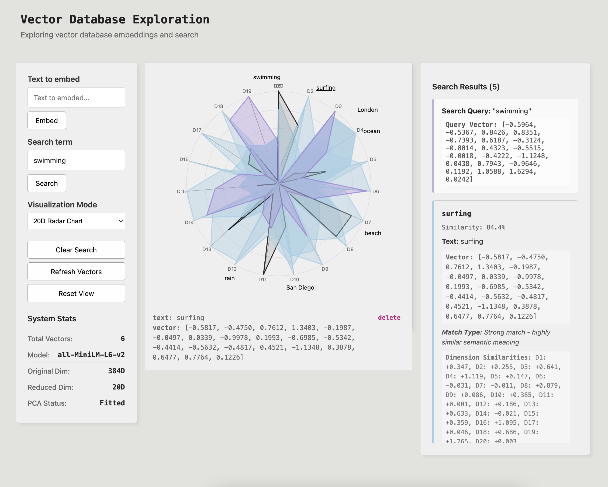

# Vector Database Exploration

Application for exploring vector database embeddings and similarity search with 3D and 20D visualizations.



## Technologies

| Tool | Usage in this project |
|:---:|:---:|
| Python | Backend |
| FastAPI | REST API framework |
| [Hugging Face ll-MiniLM-L6-v2](https://huggingface.co/sentence-transformers/all-MiniLM-L6-v2) | model for text to vector embedding |
| [Scikit-learn PCA](https://scikit-learn.org/stable/modules/generated/sklearn.decomposition.PCA.html) | vector decomposition |
| D3.js | 20D data visualization |
| Three.js | 3D data visualization |

## Development

```
make setup  - Create virtual environment and install dependencies
make start  - Start frontend and backend
make test   - Run unit tests
make stop   - Stop frontend and backend
```


